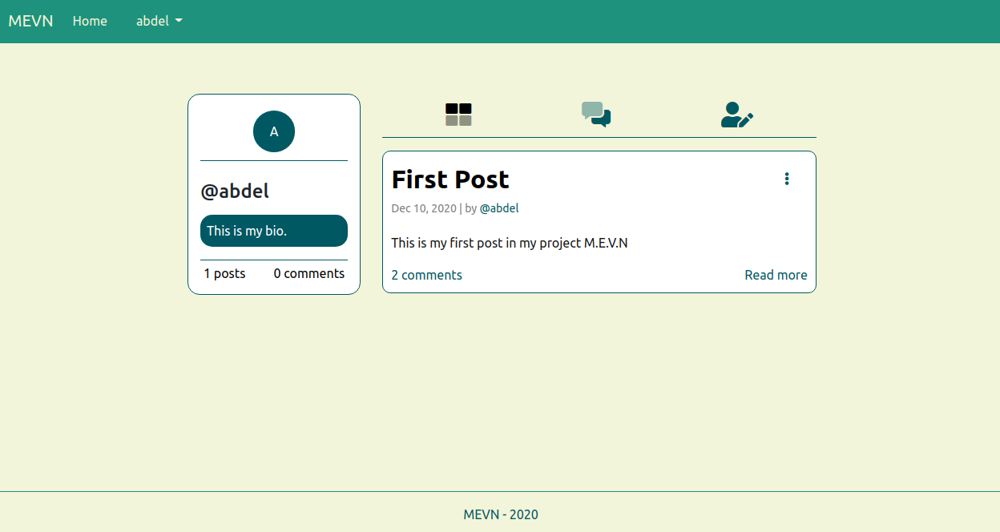

<h1 align="center">
🌐 M.E.V.N Stack
</h1>
<p align="center">
MongoDB, Expressjs, VueJS, Nodejs
</p>

# Table of contents
* [General info](#general-info)
* [M.E.V.N Frontend](#mevn-frontend)
* [clone or download](#clone-or-download)
* [Project structure](#project-structure)
* [Prerequirement](#prerequirement)
* [Setup](#setup)
* [Dependencies](#dependencies)
* [Screenshots](#screenshots)

# General info
> M.E.V.N is a fullstack implementation in MongoDB, Expressjs, VueJS and Nodejs.

M.E.V.N stack is the idea of using Javascript/Node for fullstack web development.

*Most people use ReactJS (M.E.R.N) instead of VueJS, but I chose Vue, because why not?!*

# M.E.V.N Frontend
This is the Client-Side of the project M.E.V.N.
***You may find the Server-Side [here](https://github.com/AbdelFit/M.E.V.N-Backend.git).***

The project consists in giving the possibility to people to be able to first create an account and connect, and once they connect they can:
- create posts, modify or delete them
- see all posts and their comments
- add comments, modify or delete them
- see their own profile, all their posts and comments as well as modify their profile informations (username, bio, password)
- see other users' profiles as well as all their posts and comments

# Clone or download
```
$ git clone https://github.com/AbdelFit/M.E.V.N-Frontend.git
$ npm i
```

# Project structure
```
package.json
public/
 ...
src/
 main.js
 App.vue
 assets/
 components/
 helpers/
 pages/
 router/
 store/
```

# Prerequirement
* [JavaScript](https://developer.mozilla.org/en-US/docs/Web/JavaScript)
> *You need to know the basics of JS*
* [NodeJS](https://nodejs.org/en/) ^10.16.3 
> *To check node's version: node -v*
* [npm](https://www.npmjs.com/get-npm) 
> *If you have installed NodeJS you'll get npm with it.*
> *To check npm's version: npm -v*
* [MongoDB](https://www.mongodb.com/2) 
> *You have to create a cluster and connect it with this project*

# Setup 

### - Run
```
npm i
npm run serve
```

### - Build
```
npm run build
```

# Dependencies
Package | Version | installation
--- | --- | ---
[@popperjs/core](https://www.npmjs.com/package/@popperjs/core) | ^2.5.4 | npm i @popperjs/core
[axios](https://www.npmjs.com/package/axios) | ^0.21.0 | npm i axios
[bootstrap](https://www.npmjs.com/package/bootstrap) | ^5.0.0-beta1 | npm i bootstrap
[core-js](https://www.npmjs.com/package/core-js) | ^3.6.5 | npm i core-js
[vee-validate](https://www.npmjs.com/package/vee-validate) | ^3.4.5 | npm i vee-validate
[vue](https://www.npmjs.com/package/vue) | ^2.6.11 | npm i vue
[vue-router](https://www.npmjs.com/package/vue-router) | ^3.4.9 | npm i vue-router
[vuex](https://www.npmjs.com/package/vuex) | ^3.6.0 | npm i vuex

# Screenshots
Once everything is setup and installed, when you run "npm run serve", you should see


## Pages
> All pages are responsive, they fit the width of every phone.

### - Home page
Once we open the url "localhost:8080", we will see the home page with the Login form and some pictures.


### - SignUp page
For new users, there is a sign-up page.


### - Posts page
Once the user is authenticated, he will end up in the posts page where he can see all the posts.


The user can add new posts, edit only his own post or delete them.


The user can also search for posts. ***He must enter 3 characters!***


### - One post page
The authenticated user can click on any post to read it's whole text and comments.


If the post belongs to the authenticated user, he can still edit it or delete it in this page. As well as he can add comments, edit them or delete them.


### - Profile page
Every user can visit his own profile or the other user's profiles.
In each profile he may see all the user's posts and comments, but for only his own profile he may also update his own informations, such as Username, Bio or change his password.




